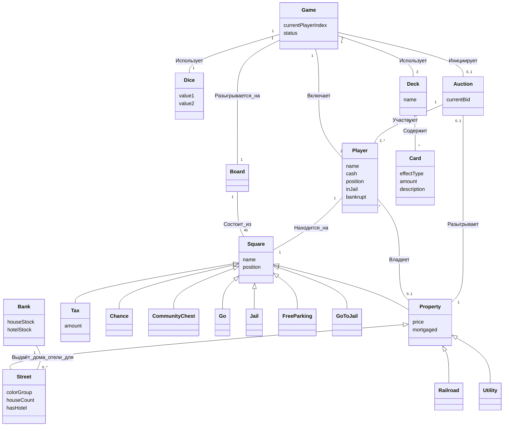

# Модель предметной области
Примерная модель предметной области представляемая классами приложения.

```mermaid
classDiagram
    class Game {
        currentPlayerIndex
        status
    }
    class Player {
        name
        cash
        position
        inJail
        bankrupt
    }
    class Board
    class Square {
        name
        position
    }
    class Property {
        price
        mortgaged
    }
    class Street {
        colorGroup
        houseCount
        hasHotel
    }
    class Railroad
    class Utility
    class Tax {
        amount
    }
    class Chance
    class CommunityChest
    class Go
    class Jail
    class FreeParking
    class GoToJail
    class Dice {
        value1
        value2
    }
    class Deck {
        name
    }
    class Card {
        effectType
        amount
        description
    }
    class Bank {
        houseStock
        hotelStock
    }
    class Auction {
        currentBid
    }

    Game "1" -- "2..6" Player : Включает
    Game "1" -- "1" Board : Разыгрывается_на
    Game "1" -- "1" Dice : Использует
    Game "1" -- "2" Deck : Использует
    Game "1" -- "0..1" Auction : Инициирует

    Board "1" -- "40" Square : Состоит_из

    Square <|-- Property
    Square <|-- Tax
    Square <|-- Chance
    Square <|-- CommunityChest
    Square <|-- Go
    Square <|-- Jail
    Square <|-- FreeParking
    Square <|-- GoToJail

    Property <|-- Street
    Property <|-- Railroad
    Property <|-- Utility

    Deck "1" -- "*" Card : Содержит

    Player "1" -- "1" Square : Находится_на
    Player "0..*" -- "0..1" Property : Владеет

    Bank "1" -- "0..*" Street : Выдаёт_дома_отели_для

    Auction "0..1" -- "1" Property : Разыгрывает
    Auction "1" -- "2..*" Player : Участвуют
```