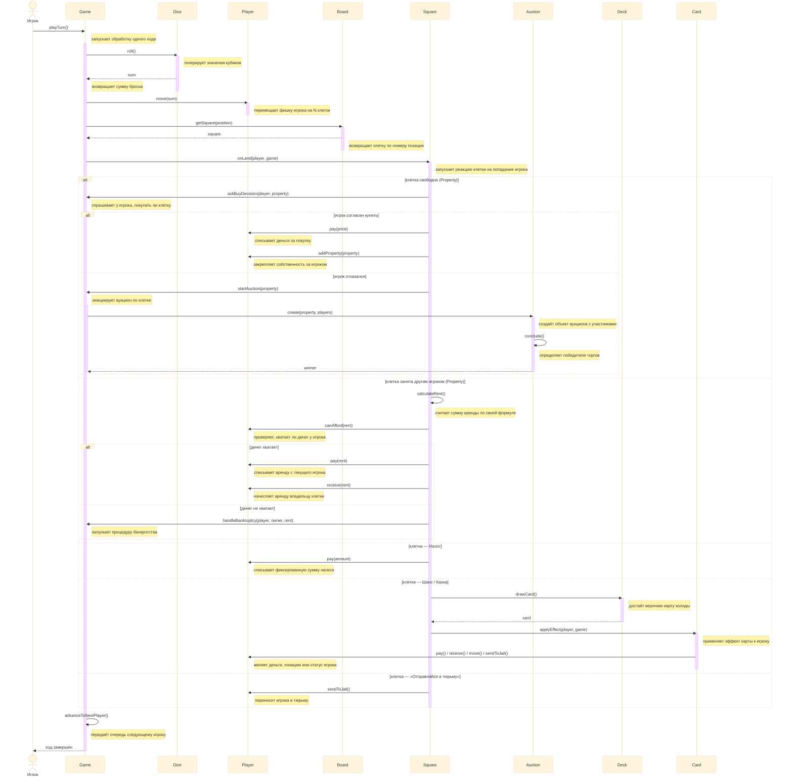

```mermaid
%%{init: {
  "theme": "base",
  "themeVariables": {
    "fontSize": "18px"
  }
}}%%
sequenceDiagram
    actor Игрок

    Игрок->>Game: playTurn()
    Note right of Game: запускает обработку одного хода
    activate Game

    Game->>Dice: roll()
    activate Dice
    Note right of Dice: генерирует значения кубиков
    Dice-->>Game: sum
    Note right of Game: возвращает сумму броска
    deactivate Dice

    Game->>Player: move(sum)
    activate Player
    Note right of Player: перемещает фишку игрока на N клеток
    deactivate Player

    Game->>Board: getSquare(position)
    activate Board
    Board-->>Game: square
    Note right of Board: возвращает клетку по номеру позиции
    deactivate Board

    Game->>Square: onLand(player, game)
    activate Square
    Note right of Square: запускает реакцию клетки на попадание игрока

    alt клетка свободна (Property)
        Square->>Game: askBuyDecision(player, property)
        Note right of Game: спрашивает у игрока, покупать ли клетку
        alt игрок согласен купить
            Square->>Player: pay(price)
            Note right of Player: списывает деньги за покупку
            Square->>Player: addProperty(property)
            Note right of Player: закрепляет собственность за игроком
        else игрок отказался
            Square->>Game: startAuction(property)
            Note right of Game: инициирует аукцион по клетке
            activate Game
            Game->>Auction: create(property, players)
            activate Auction
            Note right of Auction: создаёт объект аукциона с участниками
            Auction->>Auction: conclude()
            Note right of Auction: определяет победителя торгов
            Auction-->>Game: winner
            deactivate Auction
            deactivate Game
        end

    else клетка занята другим игроком (Property)
        Square->>Square: calculateRent()
        Note right of Square: считает сумму аренды по своей формуле
        Square->>Player: canAfford(rent)
        Note right of Player: проверяет, хватает ли денег у игрока
        alt денег хватает
            Square->>Player: pay(rent)
            Note right of Player: списывает аренду с текущего игрока
            Square->>Player: receive(rent)
            Note right of Player: начисляет аренду владельцу клетки
        else денег не хватает
            Square->>Game: handleBankruptcy(player, owner, rent)
            Note right of Game: запускает процедуру банкротства
        end

    else клетка — Налог
        Square->>Player: pay(amount)
        Note right of Player: списывает фиксированную сумму налога

    else клетка — Шанс / Казна
        Square->>Deck: drawCard()
        activate Deck
        Note right of Deck: достаёт верхнюю карту колоды
        Deck-->>Square: card
        deactivate Deck
        Square->>Card: applyEffect(player, game)
        activate Card
        Note right of Card: применяет эффект карты к игроку
        Card->>Player: pay() / receive() / move() / sendToJail()
        Note right of Player: меняет деньги, позицию или статус игрока
        deactivate Card

    else клетка — «Отправляйся в тюрьму»
        Square->>Player: sendToJail()
        Note right of Player: переносит игрока в тюрьму
    end

    deactivate Square

    Game->>Game: advanceToNextPlayer()
    Note right of Game: передаёт очередь следующему игроку
    Game-->>Игрок: ход завершён
    deactivate Game
```